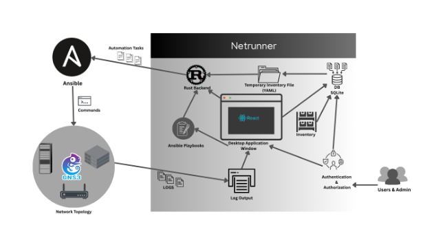

## Project Description

**Network Automation** refers to the deployment, testing, configuration,
management and the operation of physical devices and virtual devices
within a network through programming, automation tools and software.
Traditionally, the configuration of Network device is performed manually
which leads to errors, inefficiencies and delays. When completed
manually, such tasks are time-consuming and often characterized by
inconsistency, but with routine network tasks and functions automated
and repetitive methods controlled and managed automatically, network
service availability advances. (Cisco Systems, 2024)

The "**Netrunner -- Network Automation Tool**" is a desktop application
deliberate to streamline and simplify network device management through
automation. Built with a modern and intuitive graphical user interface
(GUI), Netrunner leverages **Ansible** for network automation tasks
while providing a seamless user experience through a combination of
modern desktop application development tool stack such as **Rust,
React** with **Typescript, TailwindCSS and Tauri.**

Netrunner includes key features such as --

- Dynamic Inventory Management (Add, Modify or delete hosts and Groups)

- Run Ansible playbook on Hosts or Groups via selection,

- Dynamic Selection of Playbook via Dropdown,

- Integrated Switch mode (Light and Dark).

## Current Scenario

Cloud computing, large-scale deployments, and diverse network
infrastructures make manual management impractical. Automation is
essential for initial setup and ongoing management, boosting operational
efficiency and reducing human error.

For supporting statistics and trends on the growing necessity of
automation in networking and IT infrastructure, please refer to
[**Appendix 2**](#appendix-2).

## Problem Domain and Project as a Solution

The Netrunner project simplifies network infrastructure management by
offering a unified automation tool that leverages Ansible, Rust, and
React, enhancing operational efficiency, minimizing errors, and
promoting proactive network management.

For detailed insights into the challenges of KTLO operations and
interface configuration complexities in modern networks, please refer to
[**Appendix 1**](#appendix-1).

### Problem Analysis

The complex layers of technologies, devices, and protocols are
associated with the Network environment. As networks scale, the
challenges of manual operations become more pronounced:

- **Repetitive Manual Task:** Monitoring, patching and troubleshooting
  the network are time consuming and susceptible to human errors.

- **Increased Complexity:** Networks which are growing, and diversity
  are making it difficult to manage various interfaces and protocols
  manually.

- **Limited Time for Strategic Projects:** Due to the constant focus on
  maintenance, network engineers and network architects struggle to
  implement new, innovative solutions that could optimize network
  performance and resilience.

### Project as Solution

The project focuses on leveraging Ansible; suite of software tools that
enable infrastructure as code, for automating network configuration and
management. The primary goal is to shift from reactive, manual
operations to proactive, automated workflows, reducing human error and
creating time for strategic initiatives.

In Brief,

- **Automating Repetitive Task:** Implementing Ansible playbooks for
  automating routine tasks like initial network device configurations
  like banners, interface configuration with protocol assignments. These
  playbooks run on-demand or automatically, reducing human intervention.

- **Centralized Management:** Ansible can be used for centralizing
  devices like routers, switches, firewalls simultaneously using
  inventory as YAML files which ensures consistent and standardized
  network configuration across all the devices on inventory file and
  reduce complexity.

- **Reduce Network Complexity:** Automating the process of assigning
  persistent interfaces to various protocols and handling configuration
  can reduce the risk of misconfiguration and reduces network
  complexity.

- **Infrastructure as Code (IaC) with GUI:** Using Ansible playbooks and
  UI/UX leads to a version controlled (using GitHub), shareable, and
  reproducible codified infrastructure.

##  Project Aim and Objectives

###  Aim

The project aims to develop a unified, sustainable network automation
platform that combines React' intuitive UI/UX, Rust's memory-safe
backend, Tauri's lightweight cross-platform framework, and Ansible's
robust task automation to empower network engineers. By integrating
these technologies, the tool will streamline repetitive network
operations, enforce codified infrastructure management, and minimize
human error, while prioritizing security, performance, and scalability.

###  Objectives

- Implementation of Ansible Playbooks: Automate repetitive network task
  using Ansible Playbooks which enhance operational efficiency by
  reducing the time and effort required for daily maintenance tasks,

- Dynamic Inventory Management: Utilize Rusqlite databases to centralize
  and dynamically manage network device inventories, enabling real-time
  updates and seamless integration with Ansible. This ensures scalable
  and flexible configurations while reducing manual errors.

- Enhance Network Reliability: Creating awareness using consistent
  configurations as automated network is task driven while addressing
  network issues, using automation to manage diverse devices and
  protocols enhances network reliability.

- Develop Sustainable Network Automation Tool: Using integrated
  capabilities of ReactJS, Tailwind CSS, Rust, Tauri and Ansible this
  project plans to deliver user friendly network automation tool which
  will free up time for innovative and strategic planning for network
  engineers.

## System Architecture

The architecture of Netrunner is designed to provide a seamless,
efficient, and secure environment for network task automation, utilizing
modern technologies across four key layers -- frontend, backend,
automation, and database. The diagram below illustrates the flow of
information and tasks within the system.
<figure>

<figcaption>
: Demonstration of System Design.
</figcaption>
</figure>

The following are the major components of the system that made possible
to develop Netrunner project --

1.  **Rust Backend:**

The Rust backend handles application logic, security, and communication
between frontend and other components. It fetches pre-defined Ansible
Playbooks, interacts with Rusqlite Inventory databases, and executes
fetched playbooks to the selected inventory while creating a temporary
YAML format inventory file required for task execution and captures the
output log.

2.  **React + Tailwind CSS + Typescript Frontend (Desktop GUI)**

The user interface is built using React for component-driven structure,
Tailwind CSS for efficient styling, and TypeScript for type safety and
scalability. This combination offers an intuitive and responsive desktop
application frontend, enabling users to interact with device
inventories, execute playbook, and view output logs.

3.  **Tauri Framework**

Tauri wraps the frontend and backend into lightweight app using OS's
native web renderer as the size of the Tauri application can be little
as 600 KB, Tauri also builds application with Cross-Platform
capabilities for any operating system such as Linux, macOS, Windows,
Android and IOS -- all from single codebase. As it utilizes native OS
integration with minimal resource usage, it allows seamless
communication between frontend and backend.

4.  **Rusqlite Database**

A local, embedded Rusqlite Database stores structured inventory data,
and user credentials. Rusqlite is an ergonomic wrapper for using SQLite
from Rust. It supports fast and reliable data access, enabling dynamic
inventory management and real-time updates.

5.  **Ansible Automation Engine**

Ansible is used to automate repetitive network tasks using YAML-based
playbooks and inventory. It interacts with network devices (simulated
via GNS3), executes defined commands, and returns results back to the
system for logging and visualization.

6.  **GNS3 Client Environment**

GNS3 provides the simulated network topology where the Ansible
automation tasks are executed for testing purposes. It allows testing of
configurations, gathering device information in a controlled virtual
environment before performing on a live system.

7.  **GNS VM using VMware Workstation**

The GNS VM is hosted in VMware Workstation to emulate real network
devices where IOS and IOU images are stored in the VM which can be
accessed with the GNS3 Client. Bridge Mode networking connection is used
to connect the virtual lab with the host with the Ansible automation
engine. This setup enables seamless communication between the Netrunner
application and simulated network devices, allowing for real-time
automation and testing across the network.

#### System Working Mechanism 

The Netrunner application uses a purposeful workflow where users start
with authentication to handle inventory control before choosing
playbooks and creating temporary inventory file while running Ansible
tasks before recording results. The application combines all its steps
through seamless integration between frontend and backend, so users get
a smooth experience while automation runs reliably.

**\[Note:** For a detailed breakdown of the system workflow and
execution flow, please refer to [Appendix 11](#appendix-11).**\]**

##  Technical Components and Tools 

The development of Netrunner used a contemporary technology
infrastructure which integrates React for frontend development with Rust
for backend processes and Ansible for automated network management. A
combination of Tauri along with Vite was used for creating a
platform-agnostic solution that delivered high performance with safe
data storage capabilities. The development puzzled together a set of
architectural components and framework selections to boost system
usability along with performance speed and add scalability
functionality.

**\[Note:** For detailed information, Refer to [Appendix
10](#appendix-10)**\]**

##  Similar Projects 

To provide a broader perspective on existing network automation
solutions, detailed descriptions of Puppet and Cisco DNA have been
included. These tools represent two different approaches to
automation---system-level configuration and enterprise-level network
orchestration---serving as valuable comparisons to Netrunner\'s
objectives and scope.

**\[Note:** For full descriptions and visual references, please refer to
[Appendix 4](#_6.5_Appendix_4).**\]**

##  Comparison between Projects 

A comparative analysis was conducted between Netrunner, Puppet, and
Cisco DNA to highlight their purposes, architecture, target users, and
automation capabilities. This comparison helps position Netrunner in the
broader context of network automation tools, especially for small to
medium-scale environments.

**\[Note:** For a detailed comparison table, please refer to [Appendix
5](#_6.4_Appendix_5).**\]**

###  Why Netrunner? 

Netrunner is a network automation tool that is developed to tackle the
modern network intricacies and issues related to scalability. Unlike
traditional methods that often rely on extensive manual configuration
and troubleshooting, Netrunner leverages Ansible playbooks and a React
based graphical user interface (GUI) layer over Ansible to rid
repetitions of manual tasks, guarantee same configurations are employed,
and minimize opportunities for mistakes. This makes it valuable for
automating network tasks raising operational productivity hence enabling
network engineers to manage the networks with little focus on trivial
issues. Through the combination of React, Rust backend and Tauri,
Netrunner presents a sleek cross-platform application giving the
capability to perform activities like network device management, basic
network configurations, and analyzing network interface and
configuration.

Moreover, the Netrunner developed with the concept of scalability and
flexibility in mind the product can be effectively used in the small
branch office networks as well as in the large enterprise networks.
Compared to other tools such as Puppet and Cisco DNA, Netrunner can
provide cost and flexibility-effective solutions that are ultimately
designed for network engineers. It will be completely non-commercial and
freely available, which supports connection with a broad spectrum of
devices and systems, including using SSH interactions. In Netrunner's
ability to customize the various processing pathways, it will position
itself well to be efficient in being fashionable for today's network
handling and management operations.

## Selected Methodology

(Schwaber & Sutherland, 2020) Scrum developed by Ken Schwaber and Jeff
Sutherland is used at any time complex products must be developed. Scrum
is an Agile development type. Projects organize Scrum, a management
structure, to manage teams who independently allocate tasks and work
towards a shared goal. It is a structure within which individuals and
groups may address complex adaptive issues and at the same time optimize
product delivery innovation and efficiency. Scrum is used to
self-organize and strive toward a common objective as Scrum ensures that
we remain creative and productive while enabling us to create goods of
the greatest caliber and with Scrum, development happens in small
increments, iterations, and thus capable of adapting to new
requirements.

Scrum has some values which are Courage, Focus, Commitment, Respect and
Openness to be considered by the development team or an individual.

##  Phases of Methodology 

Implementation of the Scrum methodology in the Netrunner tool
development involved the following five key phases. According to the
goal of each phase, tasks were organized into short iterations or
Sprints and tracked using Trello board to ensure timely delivery and
iterative improvement.

###  Inception (Product Backlog)

Every project requiring success needs to establish a solid foundation
initially. The initiation phase sets out a clear product vision which
establishes both project goals and high-level deliverables along with
scope definition and objective description. Team members receive their
responsibilities, and the initial product backlog receives its features
while the development team gets formed. The project initiation phase
establishes a common vision between all stakeholders regarding both the
project objectives and the established goals.

+-------------+--------------------------------------------------------+
| Overall     | - Define the product vision, gather initial            |
| Goal        |   requirements and identify key stakeholders to set a  |
|             |   clear direction for the project and develop a        |
|             |   foundational framework for planning and executing    |
|             |   the project                                          |
+=============+========================================================+
| Expected    | - A comprehensive Product Backlog outlines the core    |
| Overall     |   features and functionalities.                        |
| Outcome     |                                                        |
|             | - Clear understanding of project scope, targeted user, |
|             |   and key business objectives.                         |
|             |                                                        |
|             | - Identification of project risk and strategies for    |
|             |   early mitigation.                                    |
|             |                                                        |
|             | - Defined communication plan and project timeline      |
|             |   aligned with sprint-based delivery.                  |
+-------------+--------------------------------------------------------+

###  Planning and Estimation 

After a vision is established, the team needs to move into planning and
the product backlogs are broken down into epics and refined into
tactical user stories. Collaborating with the Product Owner, the team
estimates and prioritizes these stories. A Sprint Backlog serves as a
document which specifies the information to deliver through the next
sprint period. This stage prepares the way for specific time-constrained
iterations to follow.

###  Execution

Team members proceed to development after finalizing the plan. The team
carries out Sprint execution by processing user stories from the Sprint
backlog. Weekly stand-up meetings allow teams to maintain transparency,
which display advancement as well as remove obstacles. The work progress
is tracked through tools such as burndown charts and Trello to validate
continuous work movement while maintaining focus on the sprint goal.

###  Review and Retrospective

During Sprint Review sessions at the sprint conclusion the team exhibits
their work to stakeholders who then offer their assessment.
Retrospective is conducted afterward when the group assesses successes
and failures while figuring out methods to advance during subsequent
sprints. This phase strengthens Scrum's core value of continuous
improvement alongside adaptive measures.

### Release

The outcome of development initiatives reaches its end during the
release phase. Through this approach users receive functional product
builds that give them early access to valuable product outputs. The
successful completion of a project may prompt teams to organize both a
project-wide retrospective for success achievement combined with lessons
identification for project evolution.

##  Survey Results

### Pre-Survey Results

The pre-development survey was conducted to gather user insights into
network automation preferences, familiarity with automation tools and
user interface exceptions from Netrunner tool. The survey received a
total of 14 responses from individuals ranging from students to
professionals such as network engineers and system administrators.

**Highlights from the pre-survey**

- Respondents were affiliated with organizations like Vianet
  Communications, BL Enterprises, and Islington College.

- 57.1% of participants identified as students, while 35.7% were network
  engineers.

- 78.6% had used Python with libraries like Netmiko or NAPALM, followed
  by Ansible (28.6%) and Cisco NSO (21.4%).

- 50% of respondents rated Ansible as highly suitable, while 35.7% rated
  it as suitable for network automation.

- The most requested features in a network automation tool included:

  - Automated configuration (85.7%)

  - Easy-to-use GUI (85.7%)

  - Multi-vendor support (78.6%)

  - Error detection & rollback (78.6%)

  - Secure communication protocols (78.6%)

- 42.9% rated a React-based GUI as highly important, with an additional
  21.4% giving it a score of 9 out of 10.

- When asked about deployment preferences, 28.6% strongly preferred a
  desktop application built with Electron, while 28.6% remained neutral.

- For running Ansible playbooks, 50% preferred using Python with
  ansible-runner. Other choices included:

  - Ansible Tower (21.4%)

  - Custom REST API (7.1%)

  - Local execution (7.1%)

  - Dockerized Ansible (7.1%)

- 64.3% expressed willingness to test the tool and provide feedback
  during development.

- 3 responses from the participants also suggested insightful
  suggestions for future enhancements.

### 3.4.2 Post-Survey Results

A post-development survey was conducted to evaluate user satisfaction
and effectiveness of the Netrunner network automation tool after
implementation. A total of 23 responses were collected from individuals
including students, network engineers, IT support staff, system
administrators, and programmers.

**Highlights from the post-survey:**

- 47.8% of participants identified as students, while 30.4% were IT
  support staff and 8.7% were network engineers.

- 43.5% had no prior experience with network automation tools, while
  34.8% were at an intermediate level.

- 60.9% of respondents rated Netrunner as very easy to use, while
  another 17.4% found it easy.

- The average UI rating was 9.04 out of 10, with 65.2% giving a perfect
  score of 10.

- 69.6% of users found the interface very intuitive, with another 13%
  rating it as intuitive.

- 78.3% of users said the tool fully met their expectations for
  automating network tasks.

- The most useful features, as voted by users, were:

  - Playbook Runner GUI (100%)

  - Dynamic Inventory Management (95.5%)

  - Toggle Appearance Mode (86.4%)

- 69.6% of users were very satisfied with the performance of the tool,
  and no respondents marked it as unsatisfactory.

- The playbook execution feature was considered very useful by 78.3%,
  with 21.7% finding it useful.

- 68.2% of participants confirmed that output logs provided clear and
  sufficient feedback.

- When asked if they would recommend Netrunner to others in their field:

  - 65.2% responded Definitely

  - 17.4% said Probably

- Participants also suggested insightful suggestions such as:

  - Addition of a playbook creator

  - Implementation of a log analysis dashboard

The post-survey responses indicate a strong positive reception of the
Netrunner tool, particularly for its intuitive GUI, ease of use, and
effective playbook execution features. Constructive suggestions will
inform future enhancements in usability and functionality.

##  Requirement Analysis

The process of requirement analysis combines user-based system needs
understanding with stakeholder and technical group requirements that
produce functional along with non-functional specifications for guiding
development activities.

A complete specification and description of requirements for successful
development activities has been developed and documented in SRS
document.

Othe requirements for the completion of Netrunner tool development are
listed below:

###  Hardware Requirements

A PC equipped with WIFI or Ethernet connection with minimum
requirements:

- **Processor:** Apple M1/M2 or Intel i5/i7

- **Ram:** 8 GB or higher

- **Storage:** SSD with at least 50 GB free space

- **Operating System:** Debian/ MacOS

###  Software Requirements

- **IDE**: Visual Studio Code,

- **Node JS,**

- **React JS,**

- **Tailwind CSS,**

- **Rust,**

- **VMware Workstation,**

- **GNS3 VM,**

- **IOS and IOU images:** Cisco Router and Cisco L2/L3 switches,

- **Version Control:** GitHub,

- **Designing and Developing Wireframes**: Wireframe

- **Developing Diagrams and Charts**: (Draw.io, PlantUML),

- **Developing Gantt Chart**: TeamGantt,

- **Project Management Tool**: Trello
## 4.3 Critical Analysis

###  Test Summary

Testing under incremental prototyping revealed success by evaluating
functional modules one by one in real operation. The three subsystems
received testing for their main programs combined with playbook resource
management systems and front-end element functionality. Testing focused
on 19 backend tests to confirm both data accuracy and functional CRUD
operations after ensuring playbooks executed without problems. Tests of
frontend system parts were performed on 25 essential components through
unit testing of React elements and dynamic list functions and form
behavior. The tests recognized uncommon situations while strengthening
error reaction which made the program more robust and dependable. During
testing the procedure enhanced the system\'s capability to handle errors
that occur from both user input failures and backend service breakdowns.

###  Evaluation 

The system evaluation took place according to the main project
objectives and primary aim. The primary focus behind Netrunner
development involved building a sustainable tool for network automation
across platforms which automates repetitive tasks while allowing
inventory management from dynamic sources before executing Ansible
playbooks through minimal interface interaction. The system existed to
assist network engineers and system administrators through automation
which reduced manual configurations while maintaining consistency and
enhancing operational efficiency in networks that spanned from medium to
large scales.

The system worked to remove command-line interface dependency by
creating an easy-to-use graphical user interface for desktop application
security and lightness. The system presents a contemporary
infrastructure as code framework through its combination of real-time
logging and secure credential storage features with group-based
inventory resources. Evaluation of the system includes the following
assessment:

####  Evaluation of Project Deliverables

The project delivered several artifacts including Feasibility Report and
Software Requirement Specification (SRS), System Design Documentation
and Frontend and Backend Module Development in addition to Dynamic
Inventory Management and GUI for Playbook Execution and Logging
Mechanism and Testing Reports and Final Working Application. All
deliverables produced from this project underwent validation as the
Scrum methodology guided development work inside the stated project
period. The development process employed stakeholder feedback sessions
followed by successful sprint preparation work with execution delivery
and complete unit testing alongside integration testing. The project
success is confirmed through deliverable completion which followed
defined deadline milestones.

####  System Evaluation

The Netrunner system features received assessments based on the proposed
system objectives. The Netrunner system achieved all functional features
which incorporate device inventory management as well as group control
and secure credential storage and graphical playbook execution. The
system design matched the specifications of Vianet Communications Pvt.
Ltd. As a client established deployment which led to testing operation.
The system currently meets all main project requirements yet still has
potential to develop additional features involving multi-user functions,
GUI playbook creation using templating and system monitoring in future
development.

Testing of the application occurred in a simulated GNS3 environment
which verified automated real network device configurations and output
collection while managing invalid credentials and nonexistent playbook
issues. The tool demonstrates its worth as a functional solution which
helps network engineers, and their organizations eliminate
time-consuming manual work. The system proves to be an effective network
automation solution because it conducts daily operations automatically
while logging activities in real-time and managing network devices from
a centralized position.

###  Criteria

The Netrunner system achieved success in implementing most aspects of
its defined criteria. All the specifications related to the system have
received attention through the creation of an easy-to-use application
that automates network configuration tasks. The system successfully
implements all core requirements defined by the client through its
features for dynamic inventory management together with secure playbook
execution while providing real-time output logging.

The planned system features including using Tauri for cross-platform
capabilities together with Ansible automation capabilities and
Rust-based backend and Tailwind CSS with React for the responsive GUI
were successfully implemented. The project meets all defined evaluation
requirements because stakeholders received successful execution of every
intended functionality.

##  Future Works

The Netrunner tool current version addresses all its fundamental needs,
yet it presents opportunities for growth in various areas. The
application now enables multiple network engineers to work together
securely under role-based permissions structures that keep access
control requirements intact.

The future work includes integrating the tool with network monitoring
systems using both the ELK Stack and Zabbix platforms. Such integration
would supply real-time network performance visualization to improve the
tool\'s capabilities across configuration management boundaries. The
development of RESTful API support will let external systems access the
inventory database for automatic playbook execution capabilities to
create smooth automation processes across bigger environments.

The tool needs an automatic rollback feature which enables users to
restore previously saved configuration settings after playbook failures
occur. The application development should consider adding bulk import
capabilities based on CSV and JSON files to make it easier for users to
bring in device inventories and create backups of this data.

The user-friendly and scalable capabilities of the application will
improve through enhanced UI/UX features that include better filtering
tools with search options and notification mechanisms for enterprise
implementation. Such developments would transition Netrunner into a
powerful network automation platform able to handle diverse application
needs for the upcoming era for developing technologies.

#  Report Conclusion

##  Conclusion

The creation of Netrunner network automation represents an important
solution to practical problems faced by network administration personnel
and engineering staff. This project applies Ansible for automation
together with Rust for performance and security while utilizing Tailwind
CSS and React for an intuitive GUI and Tauri to deliver cross-platform
lightweight deployment features for user-centric automation of network
configuration routines.

Real-time feedback enables the tool to give centralized management of
devices with playbooks execution while eliminating manual operations and
human error and streamlining time-consuming operations. The project
adopted industry's best practices that ran from requirement analysis and
agile sprint development all the way to strict testing and stakeholder
validation which made the final product robust as well as secure yet
efficient. The application of Netrunner successfully demonstrates
practical use in operating environments managed by Internet Service
Providers such as Vianet Communications Pvt. Ltd. Simulation platforms
like GNS3 can prove the reliability of the tool by validating the system
through testing operations which preceded live implementation. An
extensible architecture approach gives Netrunner the framework needed to
implement upcoming features including multi-user functionality API
connections and system monitoring capabilities.

The project\'s execution shows deep understanding of current network
infrastructure needs in addition to excellent technical capabilities and
solutions to network problems. This project provides an essential base
for next-generation network automation and showcases open-source
scalable intelligence in modern IT system automation solutions.

##  Social, Legal and Ethical Issues

To ensure the project adhered to institutional, academic, and
professional standards, all social, legal, and ethical considerations
were carefully addressed throughout the development of Netrunner. From
data privacy and software licensing compliance to ethical research
practices and responsible content creation, every phase was conducted
with integrity and transparency.
